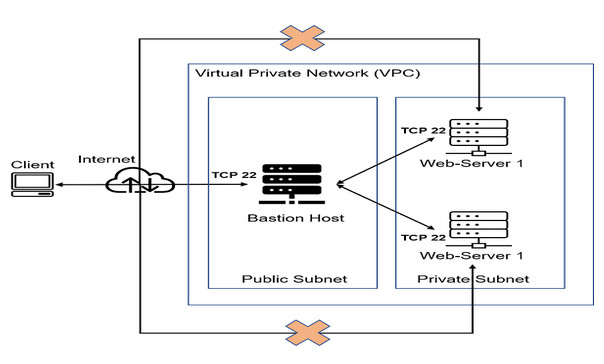
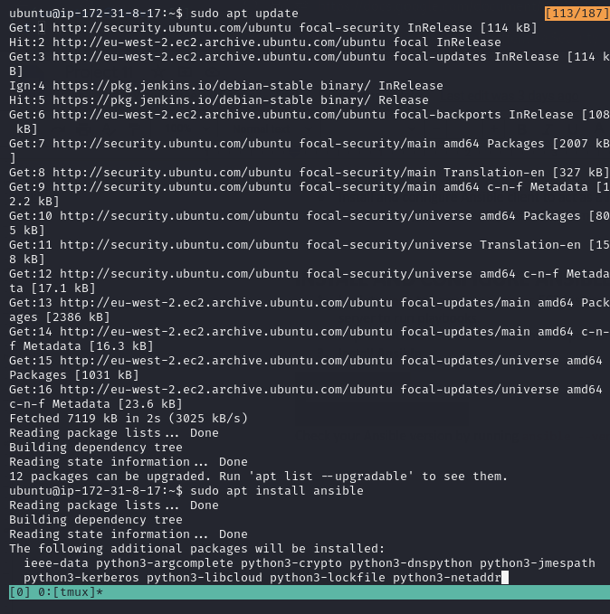
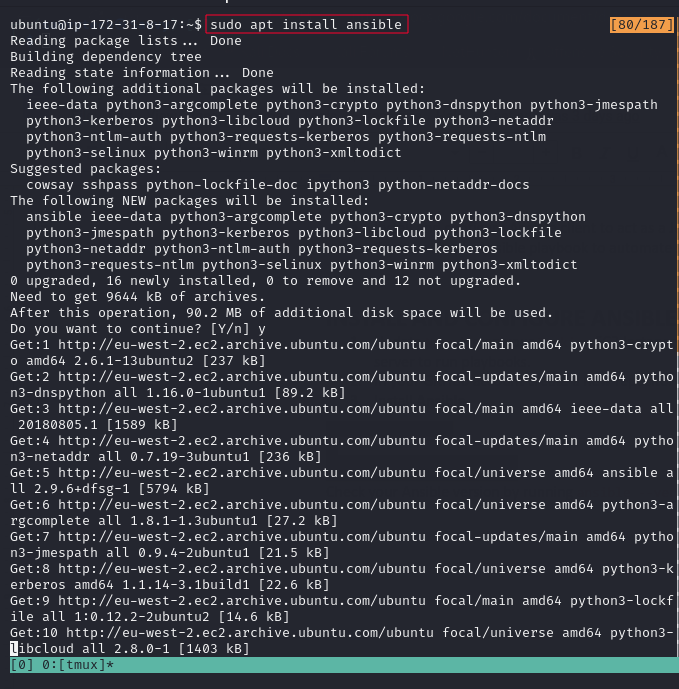
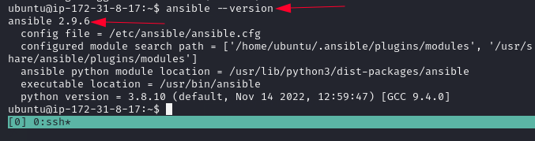

## Configuration Management
According to [Red Hat](https://www.redhat.com/en/topics/automation/what-is-configuration-management#:~:text=Configuration%20management%20is%20a%20process,in%20a%20desired%2C%20consistent%20state.&text=Managing%20IT%20system%20configurations%20involves,building%20and%20maintaining%20those%20systems.), Configuration management is a process for maintaining computer systems, servers, and software in a desired, consistent state. It’s a way to make sure that a system performs as it’s expected to as changes are made over time. 

Managing IT system configurations involves defining a system's desired state—like server configuration—then building and maintaining those systems. Closely related to configuration assessments and drift analyses, configuration management uses both to identify systems to update, reconfigure, or patch.

## Ansible Client as a Jump Server (Bastion Host)
A Jump Server (sometimes also referred as Bastion Host) is an intermediary server through which access to internal network can be provided. If you think about the current architecture you are working on, ideally, the webservers would be inside a secured network which cannot be reached directly from the Internet. That means, even DevOps engineers cannot SSH into the Web servers directly and can only access it through a Jump Server – it provide better security and reduces attack surface.
On the diagram below the Virtual Private Network (VPC) is divided into two subnets – Public subnet has public IP addresses and Private subnet is only reachable by private IP addresses.

### INSTALL AND CONFIGURE ANSIBLE ON EC2 INSTANCE
* Update Name tag on your Jenkins EC2 Instance to "Jenkins-Ansible server". We will use this server to run playbooks.
* In your GitHub account create a new repository and name it ansible-config-mgt.
* Install Ansible on Jenkins-Ansible EC2 instance

        sudo apt update

        sudo apt install ansible

    
    
* After installation, Check your Ansible version by running `ansible --version`

    

* Configure Jenkins build job to save your repository content every time you change it – this will solidify your Jenkins configuration skills acquired in Project 9.
* Create a new Freestyle project ansible in Jenkins and point it to your ‘ansible-config-mgt’ repository.
* Configure Webhook in GitHub and set webhook to trigger ansible build.
* Configure a Post-build job to save all (**) files, like you did it in Project 9.
* Test your setup by making some change in README.MD file in master branch and make sure that builds starts automatically and Jenkins saves the files (build artifacts) in following folder.

`ls /var/lib/jenkins/jobs/ansible/builds/<build_number>/archive/`

Note: Trigger Jenkins project execution only for /main (master) branch.
* Now your setup will look like this:

